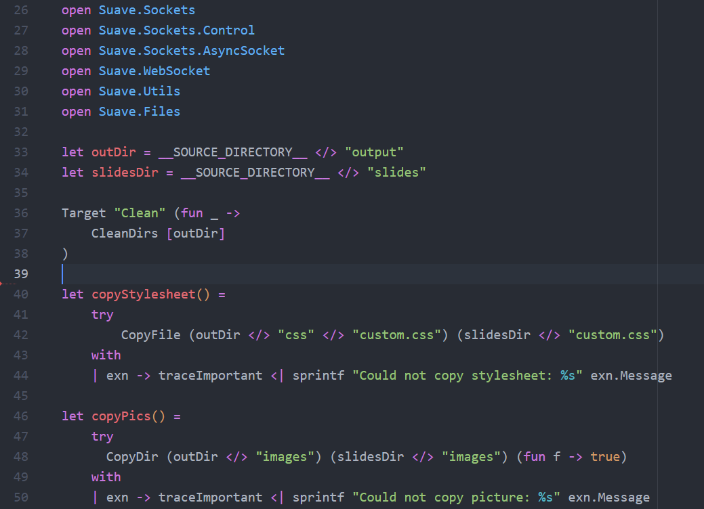
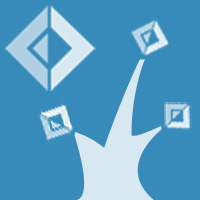

- title : Ionide and F# OSS
- description : Building Open Source F# Tooling and the F# OSS Community
- author : Jared Hester
- theme : night
- transition : default

***

## Ionide and the State of F# OSS


-------
## Jared Hester


###[https://github.com/cloudRoutine](https://github.com/cloudRoutine)
###[@cloudRoutine](https://twitter.com/cloudRoutine)


-----

### Maintainer
|-------------------------------------------------------------------|---------------------------------------|-----------------------------------------------|
||||

### Contributor
|-------------------------------|-----------------------------------------------|
|||


***

## What is Ionide?

| Atom                      |                                       | vscode            |
|:-------------------------:|---------------------------------------|:---------------------------:|
||||

---------

### Syntax Highlighting




----

### Intellisense Tooltips


---
### Autocomplete


-----
### Glyph Completion


---
### Ionide FSI


------

## Ionide Paket


---

## Ionide FAKE


---

## Code Snippets


---

## Yeoman Generator


***

# Ionide Internals

-----


----


----
```
[<ReflectedDefinition>]
module Atom.FSharp.CompletionHelpers

/// Find the minimum of three three terms that support comparison
let inline min3(a, b, c) = min a (min b c)

let inline distanceCalc (m, u) (n, v) =
    let d1 = Array.init n id
    let d0 = Array.create n 0
    for i=1 to m-1 do
        d0.[0] <- i
        let ui = u i
        for j=1 to n-1 do
            d0.[j] <- 1 + min3(d1.[j], d0.[j-1], d1.[j-1] + if ui = v j then -1 else 0)
        Array.blit d0 0 d1 0 n
    d0.[n-1]

let editDistance (s: string) (t: string) =
    distanceCalc (s.Length, fun i -> s.[i]) (t.Length, fun i -> t.[i])
```

----

***

# OSS for F# Success

----

### This Presentation was brought to you by

| FSharp.Formatting   |  Suave  |FsReveal|
|:-------------------:|:-------:|:------:|
| |  ||

----

## VFPT OSS Dependencies

- FSharp.Viewmodule
- FsXaml
- FsCheck
- FSharpLint
- Fantomas
- FsPickler
- FParsec

-------


***

## The F# OSS Community

-----

## Explore Projects

#### F# Community Incubation Space  
#### http://fsprojects.github.io/


----

### Meet the Devs

#### FPChat - Functional Programming Slack Team #fsharp


#### https://gitter.im/ionide/ionide-project


***
# The Future of Ionide & VFPT

---

##[Ionide Roadmap](https://github.com/ionide/ionide-fsharp/wiki/Ionide-Roadmap)


- FSharpLint Integration
- FsLab Integration
- Fix Integration
- More Code Snippets
- Path Completion

---

## VisualFSharpPowertools
## ->
## FSharpPowertools


***

### [Links to Projects mentioned in this presentation](https://github.com/cloudRoutine/composeconf2016)
